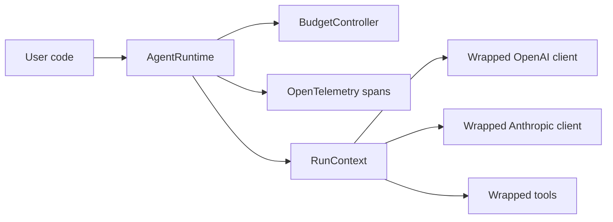

# AgentRuntime

AgentRuntime is a production runtime guardrail for AI agents. It wraps model
clients and tools with hard budget caps, timeout control, tool-call limits, and
OpenTelemetry traces, so a runaway agent loop can be stopped before it burns
through money.

The v0.1 focus is intentionally sharp: **runaway cost prevention** for async
Python agents using direct OpenAI and Anthropic wrappers.

```python
from agentruntime import AgentRuntime, BudgetConfig, RunContext

runtime = AgentRuntime(
    budget=BudgetConfig(
        cost_limit_usd="0.10",
        token_limit=10_000,
        time_limit_seconds=60,
        tool_call_limit=20,
    )
)


async def agent(ctx: RunContext, prompt: str) -> str:
    response = await ctx.openai.responses.create(
        model="gpt-5.2",
        input=prompt,
        max_output_tokens=300,
    )
    return str(response.output_text)


result = await runtime.run(agent, "research agent runtime safety")
print(result.model_dump_json(indent=2))
```

## Why This Exists

Agents are loops around probabilistic systems. When they go wrong, they can call
the same model or tool repeatedly, spend unexpected money, and fail without a
clear trace. AgentRuntime puts an explicit execution layer around that loop:



## Install

```bash
uv sync
```

Optional OpenTelemetry exporters are available through the `otel` extra:

```bash
uv sync --extra otel
```

## Try the No-Key Demo

```bash
uv run python examples/runaway_cost_prevention.py
```

The demo uses a fake OpenAI-compatible client and intentionally loops forever.
AgentRuntime stops it when the next model request would exceed the cost cap.

## Live Provider Smoke Tests

```bash
export OPENAI_API_KEY="..."
export ANTHROPIC_API_KEY="..."

uv run python examples/live_openai_basic.py
uv run python examples/live_anthropic_basic.py
```

Both live examples can be customized with `OPENAI_MODEL` or `ANTHROPIC_MODEL`.

## Quality Gates

```bash
uv run pytest
uv run pytest --cov=agentruntime
uv run ruff check .
uv run ruff format --check .
uv run pyright
```

## v0.1 Scope

- Async Python runtime with `src/` package layout.
- Hard caps for cost, tokens, time, and tool calls.
- Direct wrappers for `AsyncOpenAI.responses.create`.
- Direct wrappers for `AsyncAnthropic.messages.create`.
- OpenTelemetry spans for agent runs, LLM calls, and tools.
- Fake-client tests and demos that do not require API keys.

## Roadmap

- v0.2: per-tool circuit breakers.
- v0.3: verifier/self-healing retry loop.
- v0.4: LangGraph and OpenAI Agents SDK adapters.
- v0.5: Jaeger/Phoenix trace screenshots, blog post, and GitHub release.
