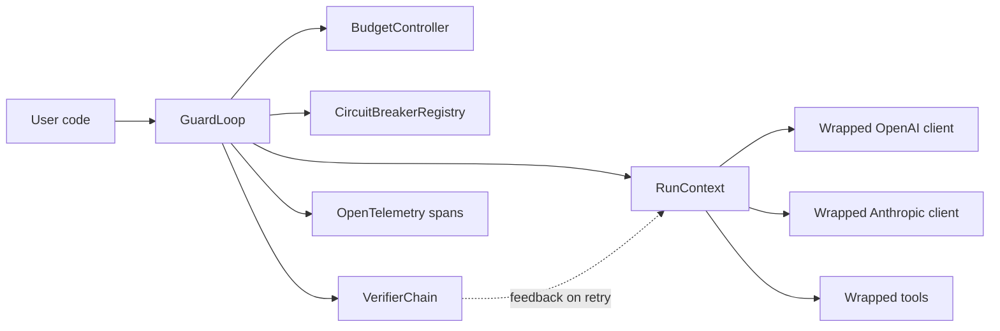

# GuardLoop

GuardLoop is a production runtime guardrail for AI agents. It wraps model
clients and tools with hard budget caps, timeout control, tool-call limits, and
per-tool circuit breakers, re-runs an agent against verifiers until the output
passes, and emits OpenTelemetry traces for every protected call. Runaway agent
loops can be stopped before they burn through money, flaky tools can be cut off
before an agent retries them into a bigger incident, and confidently-wrong
answers get a second pass.

The v0.3 focus is intentionally sharp: **runtime guardrails for async Python
agents** — direct OpenAI and Anthropic wrappers, protected tool calls, per-tool
circuit breakers, and a verify-fix-retry loop.

```python
from guardloop import (
    GuardLoop,
    BudgetConfig,
    CircuitBreakerConfig,
    CircuitBreakerPolicy,
    RunContext,
    VerifierConfig,
    is_json_object,
)

runtime = GuardLoop(
    budget=BudgetConfig(
        cost_limit_usd="0.10",
        token_limit=10_000,
        time_limit_seconds=60,
        tool_call_limit=20,
    ),
    circuit_breakers=CircuitBreakerConfig(
        default=CircuitBreakerPolicy(
            failure_threshold=3,
            recovery_timeout_seconds=30,
        )
    ),
    verifiers=[is_json_object(required_keys=["answer"])],
    verifier_config=VerifierConfig(max_retries=2),
)


async def agent(ctx: RunContext, prompt: str) -> str:
    instructions = prompt
    if ctx.retry_feedback:
        instructions += "\n\nFix the previous attempt: " + "; ".join(ctx.retry_feedback)
    response = await ctx.openai.responses.create(
        model="gpt-5.2",
        input=instructions,
        max_output_tokens=300,
    )
    return str(response.output_text)


result = await runtime.run(agent, "research agent runtime safety")
print(result.model_dump_json(indent=2))
```

## Why This Exists

Agents are loops around probabilistic systems. When they go wrong, they can call
the same model or tool repeatedly, spend unexpected money, and fail without a
clear trace. GuardLoop puts an explicit execution layer around that loop:



## Verifier Retry Loop

Agents can return confidently wrong answers. Attach verifiers — plain callables,
sync or async — and GuardLoop runs them after the agent finishes. On rejection
it feeds the verifier's feedback into `ctx.retry_feedback` and re-invokes the
agent, up to `VerifierConfig.max_retries` times. Every attempt shares the same
budget and the run's timeout, so the retry loop can never spend past a cap.

```python
from guardloop import GuardLoop, RunContext, VerifierConfig, VerifierContext, VerifierResult


def no_todo(output: object, ctx: VerifierContext) -> VerifierResult:
    if "TODO" in str(output):
        return VerifierResult(passed=False, feedback="Replace the TODO placeholder.")
    return VerifierResult(passed=True)


runtime = GuardLoop(verifiers=[no_todo], verifier_config=VerifierConfig(max_retries=2))


async def agent(ctx: RunContext, task: str) -> str:
    # On a retry, ctx.retry_feedback holds the verifier's complaints — read it.
    ...


result = await runtime.run(agent, "draft the release notes")
print(result.verification_passed, result.verification_attempts, result.verification_feedback)
```

Built-in rule-based verifiers ship in `guardloop`: `non_empty()`,
`matches_regex(...)`, `is_json_object(required_keys=...)`. By default an output
that fails every retry comes back as `success=False` with
`terminated_reason="verification_failed"` but with `output` still populated;
set `VerifierConfig(raise_on_failure=True)` for a hard stop.

## Project Guide

For a deeper walkthrough of what has been implemented, how the code is
organized, and what the next roadmap goals are, read
[docs/project-overview.md](docs/project-overview.md).

## Install

Install from PyPI:

```bash
pip install guardloop
```

For local development:

```bash
uv sync
```

Optional OpenTelemetry exporters are available through the `otel` extra:

```bash
pip install "guardloop[otel]"
```

For local development with the extra:

```bash
uv sync --extra otel
```

## Try the No-Key Demo

```bash
uv run python examples/runaway_cost_prevention.py
```

The demo uses a fake OpenAI-compatible client and intentionally loops forever.
GuardLoop stops it when the next model request would exceed the cost cap.

```bash
uv run python examples/tool_circuit_breaker.py
```

This demo uses a failing fake tool. GuardLoop allows the first failures,
opens the circuit breaker, then rejects the next call without invoking the tool.

```bash
uv run python examples/verifier_retry_loop.py
```

This demo's agent first returns a bad answer (a `TODO` placeholder, then
malformed JSON). A verifier chain rejects it with feedback, the agent reads
`ctx.retry_feedback` and self-corrects, and the run ends with
`verification_passed: true` after three attempts.

## Live Provider Smoke Tests

```bash
export OPENAI_API_KEY="..."
export ANTHROPIC_API_KEY="..."

uv run python examples/live_openai_basic.py
uv run python examples/live_anthropic_basic.py
```

Both live examples can be customized with `OPENAI_MODEL` or `ANTHROPIC_MODEL`.

## Quality Gates

```bash
uv run pytest
uv run pytest --cov=guardloop
uv run ruff check .
uv run ruff format --check .
uv run pyright
```

## v0.3 Scope

- Async Python runtime with `src/` package layout.
- Hard caps for cost, tokens, time, and tool calls.
- Per-tool circuit breakers with closed, open, and half-open states; global
  default breaker policy plus per-tool overrides.
- Verify-fix-retry loop: sync or async output verifiers, fail-fast chains,
  built-in rule-based verifiers, feedback into `ctx.retry_feedback`, and an
  opt-in strict mode — all attempts share one budget and the run timeout.
- Direct wrappers for `AsyncOpenAI.responses.create` and
  `AsyncAnthropic.messages.create`.
- OpenTelemetry spans for agent runs, LLM calls, tools, and verifiers.
- Fake-client tests and demos that do not require API keys.

## Roadmap

- v0.2: per-tool circuit breakers. ✅
- v0.3: verify-fix-retry loop. ✅
- v0.4: LangGraph and OpenAI Agents SDK adapters.
- v0.5: Jaeger/Phoenix trace screenshots, demo video, and blog post.
- v0.6: persistent breaker state, YAML/TOML policy, multi-model pricing, loop detection.
- v1.0: stable API, changelog, docs site, release checklist.

See [docs/roadmap.md](docs/roadmap.md) for details.
