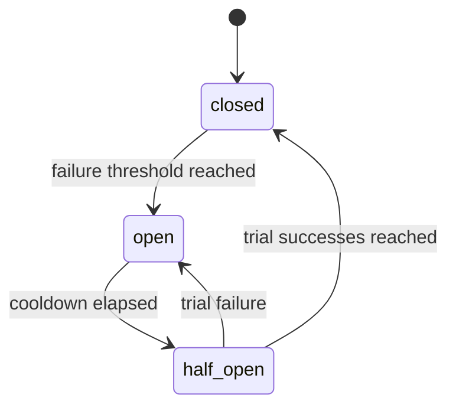

# GuardLoop Design

GuardLoop is a wrapper, not an agent framework. A user passes an async agent
callable to `runtime.run()`. The runtime creates a `RunContext` containing
wrapped provider clients and tool helpers. The agent still owns its loop; the
runtime owns enforcement.

## Enforcement Points

- Before each LLM request, the runtime estimates input tokens, reserves the
  declared maximum output tokens, and checks cost/token caps.
- After each LLM response, the runtime records actual usage from provider
  metadata.
- Before each tool call, the runtime checks the tool's circuit breaker, then
  checks and increments the tool-call count.
- The full run is bounded by `asyncio.timeout()` and monotonic clock checks.

## Circuit Breakers

Circuit breaker state lives on the `GuardLoop` instance, so it persists
across multiple `runtime.run()` calls without becoming process-global. Each
tool name gets an independent state machine:

When a breaker is open, the tool call is rejected before the tool-call budget is
incremented and before user code is invoked. Normal tool exceptions count as
failures. Controlled runtime stops, cancellations, timeouts, and open-breaker
rejections do not count as tool failures.

## Pricing

Built-in prices are defaults, not truth forever. Callers can pass
`ModelPricing` entries to override or add models as providers update pricing.

## Verifier Retry Loop

Verifiers are stateless callables (sync or async) that judge an agent's output.
A `VerifierChain` runs them in order, fail-fast: the first failing verdict wins.
Anything not a `VerifierResult` is normalized (`True`/`None` -> passed,
`False` -> failed). If a verifier itself raises, that is a verifier bug, not the
agent's: the runtime surfaces it as `VerifierExecutionError`
(`terminated_reason="verifier_error"`) and does not retry.

The runtime owns the loop, not the agent. One `BudgetController` and one
`RunContext` flow through every attempt; the only mutation between attempts is
appending the failing verifier's feedback to `ctx.retry_feedback` (and bumping
`ctx.attempt`). The agent is re-invoked with the same `*args`/`**kwargs` and is
expected to read `ctx.retry_feedback` if it wants to self-correct. Because the
budget is shared and the whole loop sits inside the run's single
`asyncio.timeout()`, a verifier loop can never spend past a cap or outlive the
time limit.

When retries are exhausted: by default the runtime returns
`RunResult(success=False, terminated_reason="verification_failed",
verification_passed=False)` with `output` still set to the last attempt — the
agent produced an answer, it just isn't trusted. With
`VerifierConfig(raise_on_failure=True)` the runtime instead surfaces a
`VerificationFailed` (same `terminated_reason`, `output=None`, attempt count and
feedback in `metadata`).

## Telemetry

Provider wrappers emit OpenTelemetry spans through a small conventions module.
This keeps GenAI semantic convention names isolated while the standard evolves.
Tool spans also include circuit breaker state, failure count, and whether a
call was blocked. Each verifier runs in a `verifier_run <name>` child span; the
root `agent_run` span carries `guardloop.verification.passed` /
`guardloop.verification.attempts` plus `guardloop.verification.failed`,
`.retrying`, and `.exhausted` events.
