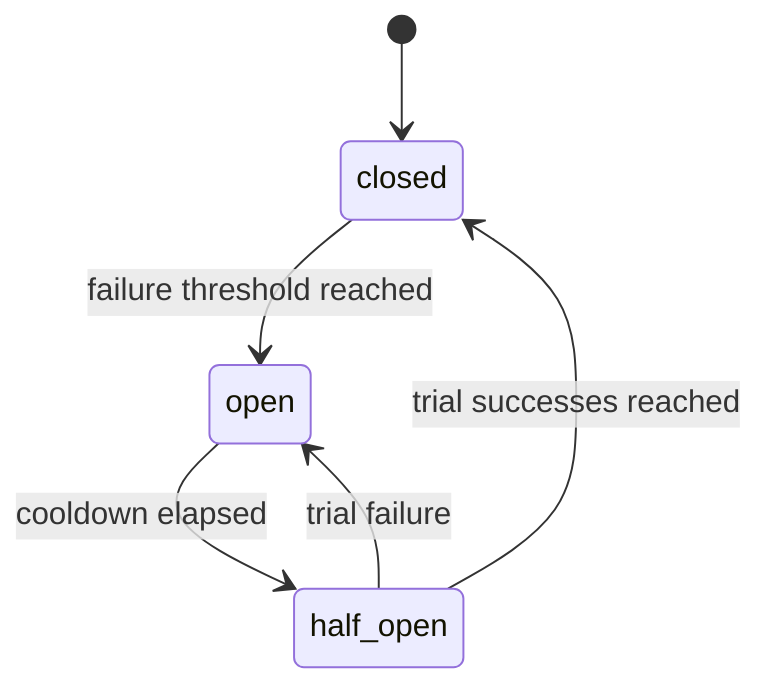

# AgentRuntime v0.2 Design

AgentRuntime is a wrapper, not an agent framework. A user passes an async agent
callable to `runtime.run()`. The runtime creates a `RunContext` containing
wrapped provider clients and tool helpers. The agent still owns its loop; the
runtime owns enforcement.

## Enforcement Points

- Before each LLM request, the runtime estimates input tokens, reserves the
  declared maximum output tokens, and checks cost/token caps.
- After each LLM response, the runtime records actual usage from provider
  metadata.
- Before each tool call, the runtime checks the tool's circuit breaker, then
  checks and increments the tool-call count.
- The full run is bounded by `asyncio.timeout()` and monotonic clock checks.

## Circuit Breakers

Circuit breaker state lives on the `AgentRuntime` instance, so it persists
across multiple `runtime.run()` calls without becoming process-global. Each
tool name gets an independent state machine:

When a breaker is open, the tool call is rejected before the tool-call budget is
incremented and before user code is invoked. Normal tool exceptions count as
failures. Controlled runtime stops, cancellations, timeouts, and open-breaker
rejections do not count as tool failures.

## Pricing

Built-in prices are defaults, not truth forever. Callers can pass
`ModelPricing` entries to override or add models as providers update pricing.

## Telemetry

Provider wrappers emit OpenTelemetry spans through a small conventions module.
This keeps GenAI semantic convention names isolated while the standard evolves.
Tool spans also include circuit breaker state, failure count, and whether a
call was blocked.
