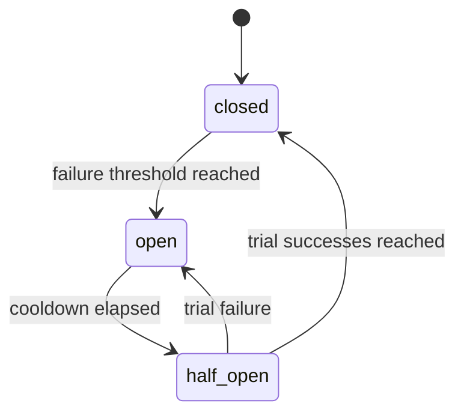

# GuardLoop Design

GuardLoop is a wrapper, not an agent framework. A user passes an async agent
callable to `runtime.run()`. The runtime creates a `RunContext` containing
wrapped provider clients and tool helpers. The agent still owns its loop; the
runtime owns enforcement.

## Enforcement Points

- Before each LLM request, the runtime estimates input tokens, reserves the
  declared maximum output tokens, and checks cost/token caps.
- After each LLM response, the runtime records actual usage from provider
  metadata.
- Before each tool call, the runtime checks the tool's circuit breaker, then
  checks and increments the tool-call count.
- The full run is bounded by `asyncio.timeout()` and monotonic clock checks.

## Circuit Breakers

Circuit breaker state lives on the `GuardLoop` instance, so it persists
across multiple `runtime.run()` calls without becoming process-global. Each
tool name gets an independent state machine:

When a breaker is open, the tool call is rejected before the tool-call budget is
incremented and before user code is invoked. Normal tool exceptions count as
failures. Controlled runtime stops, cancellations, timeouts, and open-breaker
rejections do not count as tool failures.

## Pricing

Built-in prices are defaults, not truth forever. Callers can pass
`ModelPricing` entries to override or add models as providers update pricing.

## Verifier Retry Loop

Verifiers are stateless callables (sync or async) that judge an agent's output.
A `VerifierChain` runs them in order, fail-fast: the first failing verdict wins.
Anything not a `VerifierResult` is normalized (`True`/`None` -> passed,
`False` -> failed). If a verifier itself raises, that is a verifier bug, not the
agent's: the runtime surfaces it as `VerifierExecutionError`
(`terminated_reason="verifier_error"`) and does not retry.

The runtime owns the loop, not the agent. One `BudgetController` and one
`RunContext` flow through every attempt; the only mutation between attempts is
appending the failing verifier's feedback to `ctx.retry_feedback` (and bumping
`ctx.attempt`). The agent is re-invoked with the same `*args`/`**kwargs` and is
expected to read `ctx.retry_feedback` if it wants to self-correct. Because the
budget is shared and the whole loop sits inside the run's single
`asyncio.timeout()`, a verifier loop can never spend past a cap or outlive the
time limit.

When retries are exhausted: by default the runtime returns
`RunResult(success=False, terminated_reason="verification_failed",
verification_passed=False)` with `output` still set to the last attempt — the
agent produced an answer, it just isn't trusted. With
`VerifierConfig(raise_on_failure=True)` the runtime instead surfaces a
`VerificationFailed` (same `terminated_reason`, `output=None`, attempt count and
feedback in `metadata`).

## Framework Adapters

GuardLoop is not an agent framework, so it does not "support" frameworks — it
*wraps* them. An adapter is just a thing that produces a GuardLoop-compatible
`async def agent(ctx, ...)` callable; you still call `runtime.run(agent, ...)`. The
adapters live in `guardloop.adapters`, each behind its own optional extra, and the
core `GuardLoop` class never references a framework.

The LangGraph adapter (`guardloop.adapters.langgraph.guarded_graph`) is the first.
LangGraph nodes call LangChain chat models, which do not go through GuardLoop's
`ctx.openai` / `ctx.anthropic` wrappers, so the adapter hooks the cross-cutting seam
LangChain *does* expose: a callback handler. `GuardLoopCallbackHandler` is a
*synchronous* `BaseCallbackHandler` (LangChain only honours `raise_error` for sync
handlers, and the handler does no I/O) with `raise_error = True` and
`run_inline = True`. On `on_chat_model_start` / `on_llm_start` it estimates input
tokens and runs `BudgetController.check_llm_call` (the pre-flight cost/token cap);
on `on_llm_end` it records actual usage from the response's `usage_metadata` (or
`llm_output["token_usage"]`); on `on_tool_start` / `on_tool_end` / `on_tool_error`
it routes through `before_call` / `record_tool_call_started` / `record_success` /
`record_failure`. Each LLM and tool call gets an `llm_call` / `tool_call` span that
is a child of the active `agent_run` span. Guardrail exceptions raised inside the
callbacks propagate out of `graph.ainvoke()` and are caught by `runtime.run`'s
existing arms, so a budget breach inside the graph terminates the run.

Two consequences worth knowing. First, `check_llm_call` always needs an output-token
reservation, but LangChain chat models frequently do not declare a `max_tokens`, so
`guarded_graph(...)` exposes `reserved_output_tokens` (default 1024) as the fallback
reservation. Second, tool-side enforcement is only as "hard" as the graph's own error
handling: a `ToolNode` with its default `handle_tool_errors=True` will catch a
`ToolCallLimitExceeded` / `CircuitBreakerOpen` raised by the callback and turn it
into a `ToolMessage`, so the graph continues (the breaker still records the event and
the LLM-side caps still terminate the run). Pass `handle_tool_errors=False` for hard
tool-call enforcement. Streaming (`astream` / `astream_events`) is out of scope for
v0.4.

The adapter needs `before_call` / `record_success` / `record_failure` on the per-tool
breaker registry, so `RunContext.circuit_breakers` exposes it as a public read-only
property (it persists on the `GuardLoop` instance across runs, like the breaker state
itself).

## Telemetry

Provider wrappers emit OpenTelemetry spans through a small conventions module.
This keeps GenAI semantic convention names isolated while the standard evolves.
Tool spans also include circuit breaker state, failure count, and whether a
call was blocked. Each verifier runs in a `verifier_run <name>` child span; the
root `agent_run` span carries `guardloop.verification.passed` /
`guardloop.verification.attempts` plus `guardloop.verification.failed`,
`.retrying`, and `.exhausted` events.
