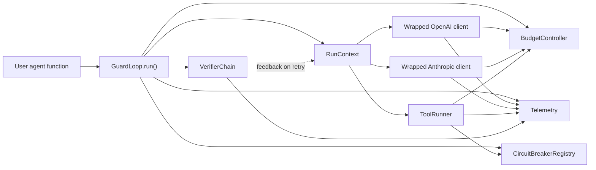

# GuardLoop Project Overview

This document explains what GuardLoop is, what has been implemented so far,
how the current system works, and what the next development goals are.

GuardLoop is a Python library for adding production-style runtime guardrails to
AI agents. Its main idea is simple: agent code can still own the reasoning loop,
but GuardLoop owns enforcement around risky operations such as LLM calls and
tool calls.

## Current Status

GuardLoop is currently published as version `0.3.0`.

- GitHub repository: `awesome-pro/guardloop`
- PyPI package: `guardloop`
- Import package: `guardloop`
- Main public class: `GuardLoop`
- Compatibility aliases: `AgentRuntime` and `AgentRuntimeError`
- Python support: `>=3.11`
- Package layout: `src/guardloop`
- Build backend: Hatchling
- Package manager: `uv`

The current portfolio story is:

1. GuardLoop prevents runaway agent cost before an expensive LLM call is sent.
2. GuardLoop prevents repeated calls to failing tools using circuit breakers.
3. GuardLoop re-runs an agent against verifiers until the output passes, bounded by the shared budget.
4. GuardLoop returns structured run results instead of leaving failures hidden.
5. GuardLoop emits OpenTelemetry spans for agent runs, LLM calls, tool calls, and verifier runs.
6. GuardLoop is typed, tested, packaged, released on GitHub, and published on PyPI.

The four pillars from the original design — resource limits, circuit breakers,
the self-healing verifier loop, and OpenTelemetry-native observability — are all
implemented as of v0.3.

## Problem Being Solved

AI agents usually run as loops around LLM calls and external tools. When those
loops fail, they can:

- call expensive models repeatedly,
- burn through tokens and cost,
- retry broken tools again and again,
- run too long,
- fail without clear observability.

GuardLoop adds a runtime layer around the agent loop. The user still writes a
normal async Python agent function, but it receives a `RunContext` with protected
LLM clients and tool helpers.

## Implemented Features

### 1. Runtime Execution Wrapper

The main entry point is `GuardLoop`.

```python
from guardloop import GuardLoop, BudgetConfig, RunContext

runtime = GuardLoop(
    budget=BudgetConfig(
        cost_limit_usd="0.10",
        token_limit=10_000,
        time_limit_seconds=60,
        tool_call_limit=20,
    )
)


async def agent(ctx: RunContext, prompt: str) -> str:
    response = await ctx.openai.responses.create(
        model="gpt-5.2",
        input=prompt,
        max_output_tokens=300,
    )
    return str(response.output_text)


result = await runtime.run(agent, "research this topic")
```

`runtime.run()` always returns a `RunResult`. Controlled guardrail stops are
reported as `success=False` with a `terminated_reason`, error metadata, cost,
token counts, duration, and tool-call count.

### 2. Budget Guardrails

GuardLoop supports hard limits for:

- total estimated and actual cost,
- total tokens,
- wall-clock runtime,
- number of tool calls.

Before each LLM call, GuardLoop estimates input tokens, reserves the declared
maximum output tokens, checks pricing, and blocks calls that would exceed the
configured cap.

After each LLM response, GuardLoop reads provider usage metadata and records the
actual input tokens, output tokens, and cost.

Important behavior:

- Cost math uses `Decimal`, not float.
- Time measurement uses `time.monotonic()`.
- Missing output-token limits are blocked before sending provider requests.
- Unknown model pricing is blocked unless custom pricing is supplied.

### 3. OpenAI and Anthropic Wrappers

GuardLoop currently wraps direct provider SDK clients:

- `AsyncOpenAI.responses.create`
- `AsyncAnthropic.messages.create`

The wrappers preserve the normal SDK calling style while adding budget checks,
usage accounting, pricing, and tracing.

Example:

```python
response = await ctx.openai.responses.create(
    model="gpt-5.2",
    input=prompt,
    max_output_tokens=300,
)
```

For Anthropic:

```python
message = await ctx.anthropic.messages.create(
    model="claude-sonnet-4-20250514",
    max_tokens=300,
    messages=[{"role": "user", "content": prompt}],
)
```

### 4. Per-Tool Circuit Breakers

v0.2 adds per-tool circuit breakers.

Circuit breaker state lives on the `GuardLoop` instance, so it persists across
multiple `runtime.run()` calls without becoming global process state.

Supported states:

- `closed`: tool calls are allowed.
- `open`: tool calls are rejected immediately.
- `half_open`: one or more trial calls are allowed after cooldown.

Default behavior:

- Circuit breakers are enabled by default.
- Default failure threshold is `3`.
- Default recovery timeout is `30` seconds.
- Default half-open success threshold is `1`.
- Per-tool overrides are supported.

Example:

```python
from guardloop import CircuitBreakerConfig, CircuitBreakerPolicy, GuardLoop

runtime = GuardLoop(
    circuit_breakers=CircuitBreakerConfig(
        default=CircuitBreakerPolicy(
            failure_threshold=3,
            recovery_timeout_seconds=30,
        ),
        tool_overrides={
            "web_search": CircuitBreakerPolicy(
                failure_threshold=2,
                recovery_timeout_seconds=10,
            )
        },
    )
)
```

Tool calls are protected through:

```python
await ctx.call_tool("tool_name", tool_function, *args, **kwargs)
```

or:

```python
protected_tool = ctx.wrap_tool("tool_name", tool_function)
await protected_tool(*args, **kwargs)
```

Open breaker calls are rejected before the tool-call budget is incremented and
before user tool code is invoked.

### 5. OpenTelemetry Tracing

GuardLoop emits spans for:

- agent runs,
- LLM calls,
- tool calls.

Spans include useful attributes such as provider, model, input tokens, output
tokens, estimated cost, actual cost, tool name, circuit breaker state, and
termination reason.

OpenTelemetry export is optional. The core library depends only on
`opentelemetry-api`; exporters are available through the `otel` extra.

```bash
pip install "guardloop[otel]"
```

### 6. Structured Exceptions

GuardLoop has a public exception hierarchy for controlled runtime stops:

- `GuardLoopError`
- `BudgetExceeded`
- `TokenLimitExceeded`
- `ToolCallLimitExceeded`
- `TimeLimitExceeded`
- `ModelPricingMissing`
- `TokenLimitMissing`
- `CircuitBreakerOpen`
- `VerificationFailed` (only in verifier strict mode)
- `VerifierExecutionError` (a verifier callable itself raised)

The runtime catches these controlled exceptions and converts them into
structured `RunResult` objects.

### 7. Verifier Retry Loop

v0.3 adds the self-healing pillar: after an agent returns, GuardLoop runs a
chain of verifiers against the output and, on rejection, feeds feedback back
and retries the agent.

A verifier is any callable — sync or async — with the signature
`(output, VerifierContext) -> VerifierResult | bool | None`:

```python
from guardloop import GuardLoop, RunContext, VerifierConfig, VerifierContext, VerifierResult


def no_todo(output: object, ctx: VerifierContext) -> VerifierResult:
    if "TODO" in str(output):
        return VerifierResult(passed=False, feedback="Replace the TODO placeholder.")
    return VerifierResult(passed=True)


runtime = GuardLoop(verifiers=[no_todo], verifier_config=VerifierConfig(max_retries=2))


async def agent(ctx: RunContext, task: str) -> str:
    # On a retry, ctx.retry_feedback holds the verifier's complaints, oldest first.
    ...
```

Built-in rule-based verifier factories ship in `guardloop`:

- `non_empty(*, allow_whitespace=False)`
- `matches_regex(pattern, *, flags=0)`
- `is_json_object(*, required_keys=())`

Behavior:

- Verifiers are configured per `GuardLoop` instance via `verifiers=[...]` or
  `runtime.add_verifier(fn)`; there is no persistent verifier state across runs.
- `VerifierChain` runs verifiers in order, fail-fast: the first failing verdict
  wins. Anything that isn't a `VerifierResult` is normalized (`True`/`None` →
  passed, `False` → failed with generated feedback).
- `VerifierConfig` controls the loop: `max_retries` (extra agent invocations
  after the first; `0` means no retry), `raise_on_failure` (strict mode),
  `pass_feedback_to_agent`, and `enabled`.
- The retry loop reuses the same `RunContext` and `BudgetController` across
  attempts — cost, tokens, time, and tool calls accumulate, so a verifier loop
  cannot bypass any cap, and the run's single `asyncio.timeout()` bounds the
  whole loop.
- `RunResult` reports `verification_passed: bool | None` (`None` if no verifiers
  ran), `verification_attempts: int`, and `verification_feedback: list[str]`.
- When retries are exhausted: by default `success=False`,
  `terminated_reason="verification_failed"`, `output` still set to the last
  attempt. With `raise_on_failure=True`, the runtime surfaces a
  `VerificationFailed` instead (`output=None`, attempt count and feedback in
  `metadata`). A verifier that itself raises becomes a `VerifierExecutionError`
  (`terminated_reason="verifier_error"`) and is not retried.

No-key demo:

```bash
uv run python examples/verifier_retry_loop.py
```

### 8. Demos

No-key demos:

```bash
uv run python examples/runaway_cost_prevention.py
uv run python examples/tool_circuit_breaker.py
uv run python examples/verifier_retry_loop.py
```

The runaway-cost demo proves that GuardLoop stops an agent before the next LLM
request would exceed the configured budget.

The circuit-breaker demo proves that GuardLoop lets a flaky tool fail up to the
configured threshold, then rejects the next attempt without invoking the tool.

The verifier-retry demo proves that GuardLoop rejects a bad answer, hands the
verifier's feedback back through `ctx.retry_feedback`, and accepts the corrected
answer on a later attempt.

Optional live provider demos:

```bash
export OPENAI_API_KEY="..."
export ANTHROPIC_API_KEY="..."

uv run python examples/live_openai_basic.py
uv run python examples/live_anthropic_basic.py
```

## Architecture



Important modules:

- `src/guardloop/runtime.py`: main `GuardLoop` execution wrapper and retry loop.
- `src/guardloop/context.py`: `RunContext` passed into user agents.
- `src/guardloop/budget.py`: cost, token, time, and tool-call enforcement.
- `src/guardloop/circuit_breaker.py`: per-tool circuit breaker state machines.
- `src/guardloop/verifier.py`: verifier types, the `VerifierChain` runner, and built-in verifiers.
- `src/guardloop/providers/openai.py`: OpenAI Responses wrapper.
- `src/guardloop/providers/anthropic.py`: Anthropic Messages wrapper.
- `src/guardloop/tools.py`: protected sync/async tool execution.
- `src/guardloop/telemetry/`: OpenTelemetry setup and attribute conventions.
- `src/guardloop/models.py`: Pydantic config/result models.
- `src/guardloop/pricing.py`: model pricing catalog and custom pricing support.
- `src/guardloop/exceptions.py`: public controlled exception hierarchy.

## Public API

Current primary exports:

- `GuardLoop`
- `BudgetConfig`
- `TelemetryConfig`
- `RunContext`
- `RunResult`
- `ModelPricing`
- `CircuitBreakerConfig`
- `CircuitBreakerPolicy`
- `CircuitBreakerState`
- `CircuitBreakerSnapshot`
- `Verifier`
- `VerifierResult`
- `VerifierContext`
- `VerifierConfig`
- `VerifierChain`
- `non_empty`, `matches_regex`, `is_json_object` (built-in verifier factories)
- `GuardLoopError`
- `BudgetExceeded`
- `TokenLimitExceeded`
- `ToolCallLimitExceeded`
- `TimeLimitExceeded`
- `ModelPricingMissing`
- `TokenLimitMissing`
- `CircuitBreakerOpen`
- `VerificationFailed`
- `VerifierExecutionError`

Compatibility aliases:

- `AgentRuntime = GuardLoop`
- `AgentRuntimeError = GuardLoopError`

## Testing and Quality

Current test coverage includes:

- cost cap pre-flight blocking,
- token cap blocking,
- tool-call limit blocking,
- Decimal cost accounting,
- OpenAI usage accounting,
- Anthropic usage accounting,
- missing output token limit errors,
- missing model pricing errors,
- successful runtime results,
- runaway fake agent termination,
- timeout handling,
- tool exception handling,
- circuit breaker open/closed/half-open transitions,
- per-tool circuit breaker overrides,
- circuit breaker reset helpers,
- verifier passes / fails-then-passes / exhausts retries,
- `max_retries=0`, fail-fast chains, sync and async verifiers,
- bool-shorthand verdicts and generated feedback,
- verifier exceptions surface as `verifier_error`,
- budget shared across retry attempts (cannot be bypassed),
- run timeout bounds the whole retry loop,
- `ctx.retry_feedback` visibility and `verification_feedback` recording,
- strict mode, disabled verifiers, built-in verifiers,
- OpenTelemetry span attributes (LLM, tool, and `verifier_run` spans).

Quality gates:

```bash
uv run pytest
uv run pytest --cov=guardloop
uv run ruff check .
uv run ruff format --check .
uv run pyright
uv build
uvx twine check dist/guardloop-0.3.0.tar.gz dist/guardloop-0.3.0-py3-none-any.whl
```

## Packaging and Release State

GuardLoop is configured and published as a real Python package.

- PyPI project: `guardloop`
- Latest release: `v0.3.0`
- Build artifacts: wheel and source distribution
- Trusted Publishing: GitHub Actions to PyPI
- GitHub environment: `pypi`
- Changelog: `CHANGELOG.md`

Publishing workflow:

- `.github/workflows/publish-pypi.yml`
- Builds distributions with `uv build`
- Uploads artifacts
- Publishes to PyPI using `pypa/gh-action-pypi-publish`
- Uses OIDC Trusted Publishing instead of a long-lived API token

## Current Limitations

GuardLoop is intentionally focused. It does not yet include:

- LLM-based verifier ergonomics (budget-tracked clients on `VerifierContext`),
- LangGraph adapter,
- OpenAI Agents SDK adapter,
- persistent circuit breaker state in Redis/database,
- provider-level circuit breakers,
- loop detection (repeated `tool + args`),
- UI dashboard,
- Jaeger/Phoenix trace screenshots,
- automated docs site,
- semantic versioning automation.

These are good future layers, but v0.3 already implements all four pillars and
is a complete portfolio-grade library foundation.

## Future Goals

### v0.3: Verifier Retry Loop — delivered

Shipped: deterministic and async verifier callables, a fail-fast `VerifierChain`,
built-in rule-based verifiers, a bounded retry loop that reuses the same budget
and run timeout, `ctx.retry_feedback`, structured `RunResult.verification_*`
fields, an opt-in strict mode, and `verifier_run` OpenTelemetry spans. The one
ergonomic gap deferred to later: budget-tracked LLM clients on `VerifierContext`
for LLM-based verifiers (today an LLM verifier must close over its own client).

### v0.4: Framework Adapters

Goal: integrate GuardLoop with common agent frameworks without changing the core
runtime model.

Planned adapters:

- LangGraph adapter,
- OpenAI Agents SDK adapter.

Portfolio value:

- shows practical ecosystem integration,
- makes GuardLoop easier to demonstrate with real agent workflows,
- proves the core design is framework-agnostic.

### v0.5: Observability Polish

Goal: turn the telemetry foundation into strong portfolio artifacts.

Planned capabilities:

- Jaeger trace screenshots,
- Phoenix trace screenshots,
- example trace walkthrough,
- demo video script,
- blog-post style architecture writeup.

Portfolio value:

- gives recruiters/interviewers visual proof,
- makes the project easier to understand quickly,
- highlights production observability skills.

### v0.6: Persistence and Team Settings

Goal: support longer-lived runtime state and reusable policy configuration.

Possible capabilities:

- pluggable state backends for circuit breakers (Redis/SQL),
- YAML/TOML policy loading and organization/team default policies,
- loop detection (repeated `tool + args` within a run),
- multi-model pricing (Gemini, Groq, Mistral) and a model pricing update workflow,
- LiteLLM integration for one wrapping path across providers.

Portfolio value:

- moves the project closer to production deployment,
- shows system design beyond in-memory library code.

### v1.0: Stable Guardrail Runtime

Goal: define a stable public API and production readiness baseline.

Potential requirements:

- documented API stability policy,
- stronger compatibility tests,
- more provider models and pricing coverage,
- richer examples,
- `CHANGELOG.md` as the source of truth (started at v0.3),
- auto-published docs site,
- release checklist,
- streaming-response accounting and Anthropic token-counting API.

## Interview Talking Points

Use this short explanation:

GuardLoop is a production runtime layer for AI agents. Instead of building
another agent framework, it wraps the risky parts of an agent loop: model calls
and tool calls. It enforces cost, token, time, and tool-call limits; stops
runaway agent loops before sending expensive requests; opens circuit breakers
around flaky tools; re-runs the agent against verifiers — feeding their feedback
back in — until the output passes, all under the same shared budget; and emits
OpenTelemetry traces so failures are observable. It is packaged as a typed
Python library, published on PyPI, tested with fake clients, and designed to
integrate with frameworks later rather than depending on one from the start.

Good questions to be ready for:

- Why use pre-flight token and cost checks before an LLM call?
- Why use `Decimal` for cost?
- Why does circuit breaker state live on `GuardLoop` instead of globally?
- Why direct provider wrappers before framework adapters?
- How would you add Redis-backed circuit breaker state?
- How would verifier retries interact with budget limits?
- How would you keep model pricing accurate over time?
- What should happen when provider usage metadata is missing?

## Recommended Next Step

All four pillars are implemented. The best next engineering milestone is v0.4:
framework adapters — slot GuardLoop *under* LangGraph and the OpenAI Agents SDK
without changing the core runtime model.

Build it narrowly:

- start with a LangGraph adapter: consult the `BudgetController` before each LLM
  node, inject a `RunContext` so the existing wrappers apply, and map the graph's
  tools onto `ToolRunner`,
- ship it behind an optional `[langgraph]` extra so core stays dependency-light,
- add an `examples/langgraph_guarded.py` that wraps a real graph,
- then repeat the pattern for the OpenAI Agents SDK `Runner`.

That proves the "wrapper, not framework" thesis: the same budget / circuit
breaker / verifier / telemetry envelope works around someone else's agent.
